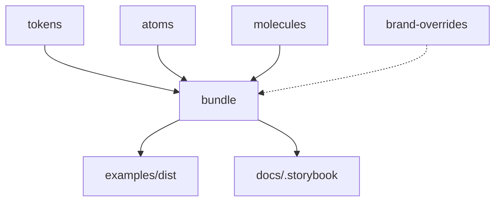

# 🔧 Build Guide - Root Block Design System

Guía completa para compilar el proyecto desde cero.

---

## 📦 **Pre-requisitos**

```bash
node >= 18.0.0
pnpm >= 8.0.0
```

---

## 🚀 **Build Completo (Recomendado)**

Este comando compila **todo** el proyecto de forma ordenada:

```bash
pnpm run build:all
```

**Qué hace:**

1. ✅ Limpia todos los `dist/` anteriores
2. ✅ Compila **tokens** (Style Dictionary)
3. ✅ Compila **atoms** (CSS → dist)
4. ✅ Compila **molecules** (Lit → dist)
5. ✅ Genera **bundles** (CSS + JS minificados + brand overrides)
6. ✅ Copia archivos a `examples/dist/` y `docs/.storybook/`

**Resultado:**

- `packages/bundle/dist/` → Todos los bundles minificados
- `examples/dist/` → Archivos listos para el demo
- `packages/docs/.storybook/` → CSS para Storybook

---

## 🎯 **Builds Individuales**

### 1. **Tokens** (Design Tokens)

```bash
pnpm run build:tokens
```

Genera CSS con variables de todas las marcas/temas.

### 2. **Atoms** (CSS Components)

```bash
pnpm run build:atoms
```

Copia CSS de componentes simples (buttons, etc).

### 3. **Molecules** (Web Components)

```bash
pnpm run build:molecules
```

Compila Web Components con Lit.

### 4. **Bundle** (Minificados + Overrides)

```bash
pnpm run build:bundle
```

Genera bundles completos:

- Tokens + Atoms + Brand Overrides
- Minificación con cssnano
- Compresión gzip + brotli
- Procesa `@import` con postcss-import

**⚠️ IMPORTANTE:** Este paso lee de `packages/brand-overrides/src/` y procesa los `@import` automáticamente.

### 5. **Copiar a Examples/Storybook**

```bash
pnpm run build:examples
```

Copia bundles a:

- `examples/dist/`
- `packages/docs/.storybook/`

---

## 📂 **Estructura de Brand Overrides**

Los overrides se procesan automáticamente durante `build:bundle`:

```
packages/brand-overrides/src/
├── davivienda/
│   ├── index.css           # → @import './button.css'
│   └── button.css          # → Estilos específicos
└── otra-marca/
    └── index.css
```

**Cómo funciona:**

1. El `builder.ts` lee `brand-overrides/src/{marca}/index.css`
2. Procesa todos los `@import` con `postcss-import`
3. Combina: Tokens + Atoms + Overrides
4. Minifica y genera `rb-{marca}-{tema}.min.css`

---

## 🔄 **Desarrollo en Tiempo Real**

### Modo Watch (Bundle)

```bash
pnpm run dev:bundle
```

Recompila automáticamente cuando cambias:

- CSS en `atoms/`
- CSS en `brand-overrides/`
- Tokens

### Storybook

```bash
pnpm run storybook
```

Inicia Storybook en `http://localhost:6007`

- Compila bundles antes de iniciar
- Carga CSS dinámicamente desde `.storybook/`

---

## 🧹 **Limpieza**

```bash
pnpm run clean
```

Elimina:

- Todos los `dist/` de packages
- `examples/dist/*.min.*`
- `packages/docs/.storybook/*.min.css`

---

## 🎨 **Demos y Visualización**

### Demo HTML

```bash
pnpm run serve:demo
```

Sirve `examples/demo.html` en `http://localhost:3000`

### Bundles CDN

```bash
pnpm run serve:bundle
```

Sirve `packages/bundle/dist/` en `http://localhost:3001`

### Storybook Build

```bash
pnpm run build:storybook
```

Genera Storybook estático en `packages/docs/storybook-static/`

---

## 🐛 **Troubleshooting**

### Error: "Cannot find module"

```bash
pnpm install
pnpm run build:all
```

### Los cambios no se reflejan

```bash
pnpm run clean
pnpm run build:all
```

### Storybook no carga los estilos

```bash
pnpm run build:bundle
# Los CSS se copian automáticamente a .storybook/
```

### Brand overrides no se incluyen

Verifica que:

1. Existe `packages/brand-overrides/src/{marca}/index.css`
2. El `index.css` tiene `@import` de los archivos necesarios
3. Ejecutaste `pnpm run build:bundle` (no solo `build:atoms`)

---

## 📊 **Pipeline de Build**



**Orden de dependencias:**

1. `tokens` → Genera CSS variables
2. `atoms` → Copia CSS componentes
3. `molecules` → Compila Web Components
4. `bundle` → Lee todo + overrides → Minifica → Genera bundles
5. `examples` → Copia bundles finales

---

## ✅ **Verificación**

Después de `pnpm run build:all`, deberías tener:

```bash
packages/bundle/dist/
├── rb-jelpit-light.min.css       # ~11.6 KB
├── rb-jelpit-light.min.css.gz    # ~2.5 KB
├── rb-davivienda-light.min.css   # ~13.7 KB (con overrides)
├── rb-davivienda-light.min.css.gz # ~2.7 KB
├── rb-*.min.css                  # (todos los bundles CSS)
└── rb-components.min.js          # ~29 KB (~8.6 KB gzip)

examples/dist/
├── rb-*.min.css
└── rb-components.min.js

packages/docs/.storybook/
└── rb-*.min.css
```

---

## 💡 **Tips**

- **Desarrollo rápido**: `pnpm run dev:bundle` + `pnpm run storybook`
- **Build completo**: `pnpm run build:all` antes de commit
- **Verificar tamaños**: `ls -lh packages/bundle/dist/*.gz`
- **Test rápido**: `pnpm run serve:demo` y abre `http://localhost:3000`

---

**¿Dudas?** Revisa los scripts en `package.json` (root y `packages/bundle/`)
